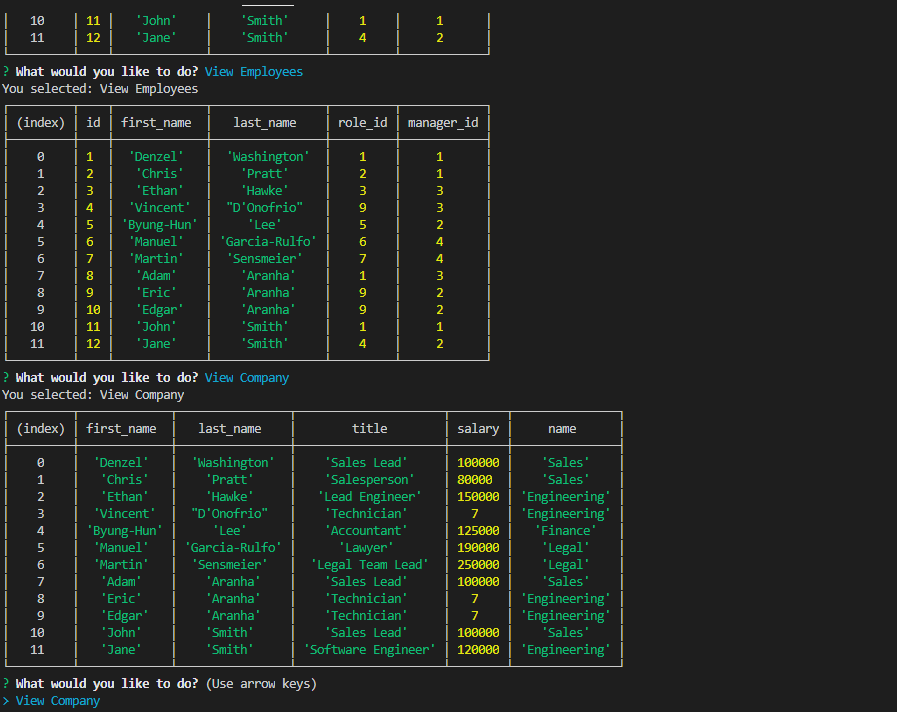

# Employee Tracker

### Table of Contents  
[Description](#Description)\
[Install Instructions](#Install-Instructions)\
[Usage Information](#Usage-Information)\
[Contribution Guidelines](#Contribution-Guidelines)\
[Testing Guidelines](#Testing-Guidelines)\
[License](#License)\
[Questions](#Questions)

## Description
An app that lets an Employer manage their employee directory. Users are able to view, add, and update the roles, departments, and employees in the directory. The data is saved in a SQL database,.

## Install Instructions
npm i.

## Usage Information
Handle with Care.

## Contribution Guidelines
.

## Testing Guidelines
.

## License
You are using the MIT license, click on the badge at the top of the page for more information.

## Questions
You can find me on [GitHub](https://github.com/AdamAranha) or you can reach me by email [here](mailto:a3aranha@gmail.com).

Screenshot:

